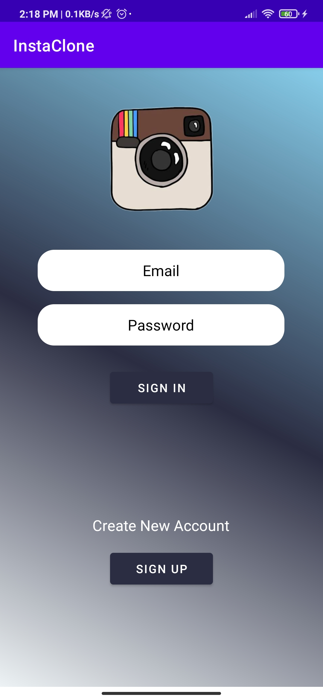
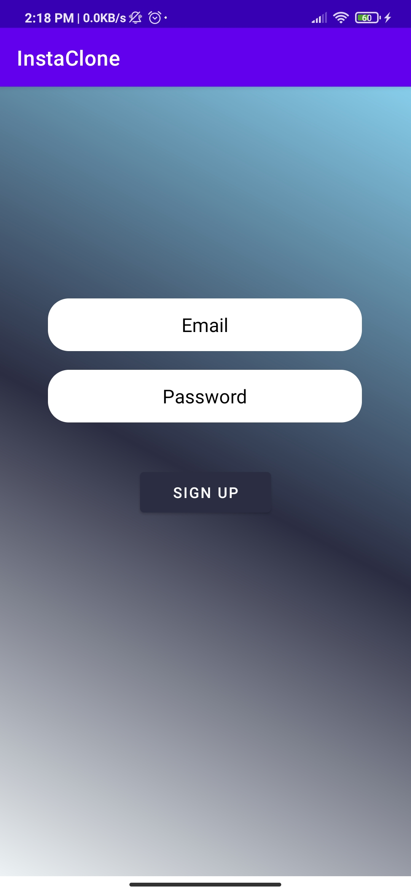
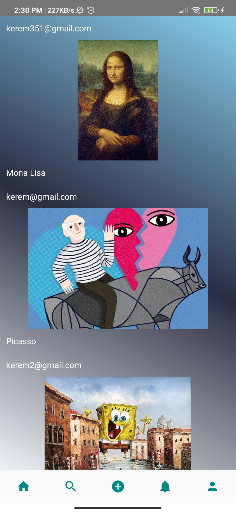
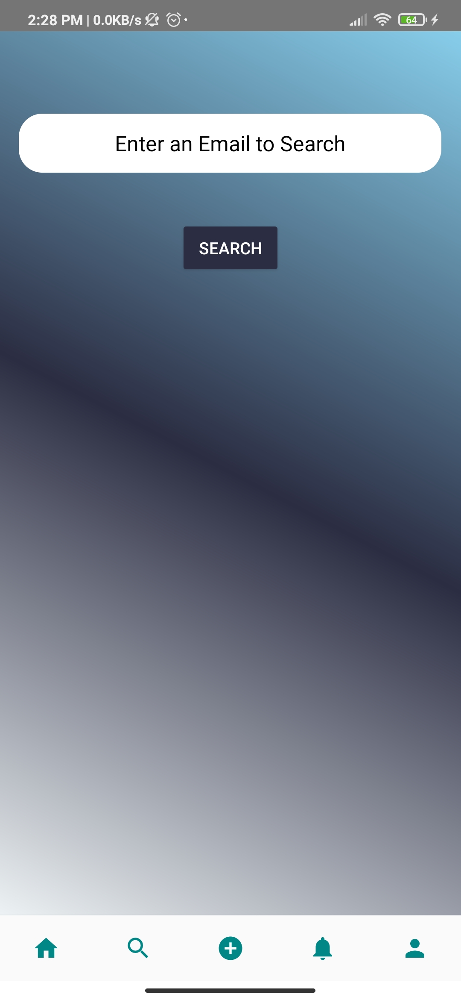
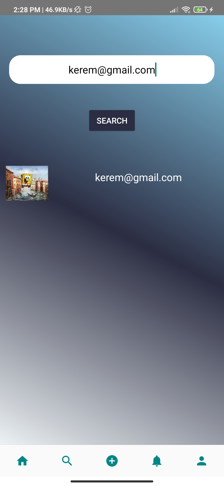
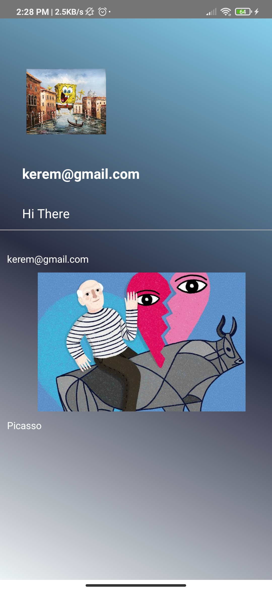
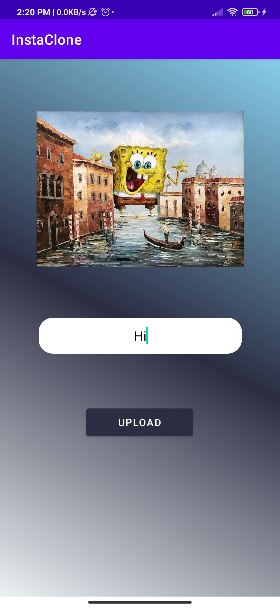
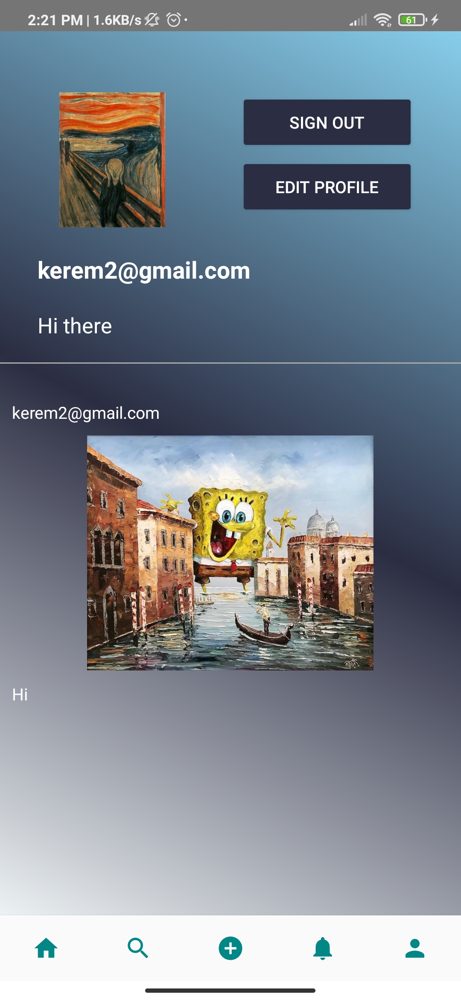
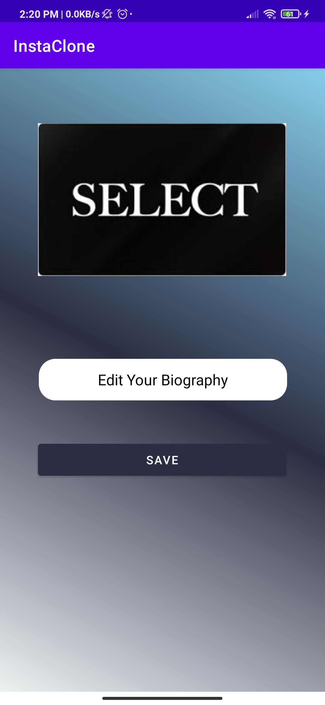
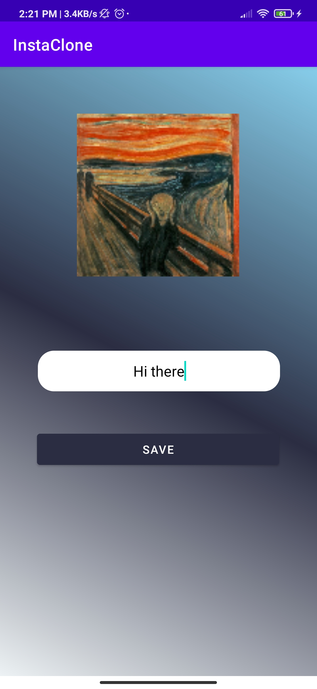

# BasicInstaClone

I worked with Firebase in this project. Sign In/Up/Out functions, Upload photos with captions functions, search profile and see profile functions are working. Posts can be seen in profile and in home page as well. Notification page and following functions are not working.

## Sign In/Up Page

 

## Home Page

## Search Page

  

## Upload Page 

 

## Profile/Edit Profile Page

  

